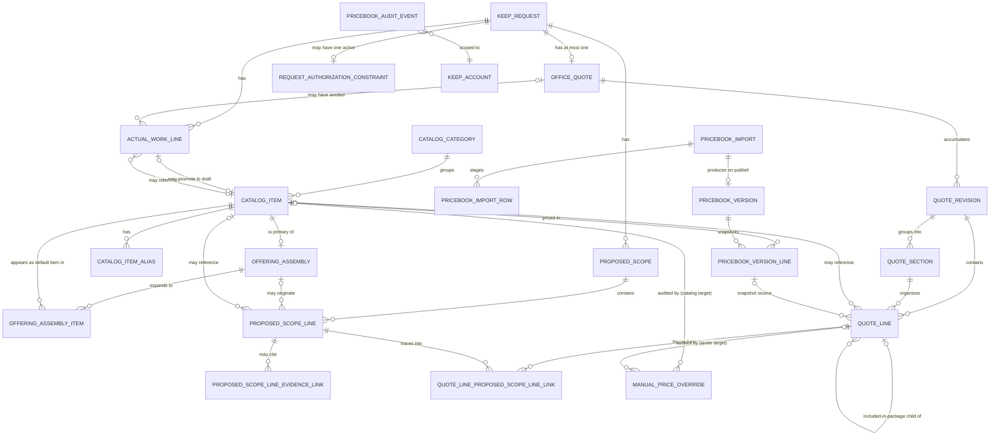

# Build Log 108 — Price Book, Quotes & Materials: ERD Preflight

**Status:** Documentation/design preflight for product-owner and Codex review — implementation not
authorized by this record
**Date:** 2026-07-30
**Scope:** Conceptual/logical data model, lifecycle, authorization, and integration contract for the
`keep.price_book_quotes_materials` capability package
**Related:** Build 101; Build 103; Build 104; Build 107; ADR-453 through ADR-463; ADR-450

## Purpose

This record turns the locked Build 107 decision into an ERD-quality conceptual model so the
product owner and Codex can review data shape, ownership, and lifecycle before any migration, API,
or UI work begins. It does not reopen, narrow, or widen any Build 107 / ADR-453–461 decision. Where
Build 107 leaves an implementation-level question genuinely open, this record says so explicitly
under "Deliberately unresolved questions" rather than guessing.

## Non-goals of this record

- No migrations, EF configurations, application services, endpoints, or UI are created here.
- No parallel architecture: every entity below reuses the account-scoping, audit-actor, concurrency,
  and event conventions already established by `OpHalo.Foundation.Core`/`OpHalo.Keep.Core` (see
  "Fit with existing conventions").
- No tax, accounting, inventory, payroll, customer-signature, or dynamic-pricing engine appears in
  this model. "Truck stock" language does not imply inventory tracking anywhere below.
- No AI/fuzzy matching for part selection: search is deterministic text matching only.
- Field-facing records are never called a "quote." The field artifact is the **proposed scope**.

## Fit with existing conventions

- Every entity is a Foundation `BaseEntity` (`Id` as `Guid.CreateVersion7()`, `CreatedAtUtc`,
  `UpdatedAtUtc`, soft-delete) and carries an explicit `AccountId` column, matching
  `KeepRequestEvent`'s denormalized-`AccountId`-on-every-row pattern rather than requiring a join
  through the request for account scoping. `BaseEntity` itself supplies identity, timestamps, and
  soft-delete only — it has no generic actor-tracking columns. Actor fields are explicit per entity,
  matching how existing entities such as `KeepRequestEvent` define their own explicit actor fields
  (`ActorAccountUserId`, `ActorDisplayName`). This module follows that same pattern: every entity
  below defines its own explicit actor column(s) (`ActorAccountUserId`,
  `RecordedByAccountUserId`, `PublishedByAccountUserId`, etc.) where its audit requirements need one.
- Mutable, multi-actor entities carry a rotating `ConcurrencyVersion Guid`, matching
  `KeepRequest.ConcurrencyVersion`/`RotateConcurrencyVersion()` and the existing `X-Keep-*-Version`
  optimistic-concurrency header contract (ADR-330–335, DEF-074). Insert-only snapshot/audit rows do
  not need one.
- Table names follow the existing `keep_*` snake_case convention (e.g. `keep_pricebook_catalog_items`).
- Money uses precise decimal storage, never float/double, matching the "no float/double for
  persisted/calculated money" rule already locked in ADR-458; this is a new convention for the
  codebase (no prior money-bearing table exists), so it is spelled out fully below.
- Entitlement/permission/policy composition reuses the existing three-part Foundation model
  (`FeatureAccessPolicy`, `PermissionKeys`, and a Keep-style `*ActionPolicy` class) rather than
  inventing a fourth authorization concept.
- Evidence links point at the existing/forthcoming Build 105 Request Field Evidence capability by
  opaque reference; this module does not own photo storage.

## Domain glossary

| Term | Meaning |
|---|---|
| Catalog item | A single priced thing: material, equipment, service, or fee. Mutable header record. |
| Catalog category | Client-configured grouping of catalog items for browsing. Not a fixed trade taxonomy. |
| Alias / search term | A technician-facing alternate name for a catalog item, used only by deterministic text search. |
| Price-book version | An immutable, published, account-wide snapshot of catalog prices at one point in time. |
| Import / staging row | A parsed, not-yet-published row from an uploaded source sheet, pending mapping/validation. |
| Offering / assembly | An office-built pairing of one primary catalog item with its default associated items and an explicit price treatment. |
| Associated offering item | One default item line that expands when a primary offering is selected. |
| Proposed scope | The technician's internal, request-linked recommendation of work/items. Never customer-facing, never called a quote. |
| Proposed scope line | One item/offering selection within a proposed scope, with optional evidence links. |
| Office quote | The office-owned, customer-facing, fixed-price commercial record for a request. |
| Quote revision | An immutable snapshot of a quote's sections/lines/total at one point in its approval lifecycle. |
| Quote line | One priced or included-in-package line within a quote revision. |
| Actual work / material line | A record of what was actually used or performed, distinct from proposed or quoted lines. |
| Authorization constraint | An optional generic limit (NTE, budget, insurer limit, approval reference) attached to a request. |
| Escape ladder | The five-rung, ordered field item-selection UX: Primary offering → Common Items → Categories → deterministic search → Off-Catalog. |

## Conceptual model



### Text fallback (grouping by ownership)

```text
Keep Core (unchanged, referenced only by ID)
  KeepRequest
    -> ProposedScope (0..n)
    -> OfficeQuote (0..1)
    -> ActualWorkLine (0..n)
    -> RequestAuthorizationConstraint (0..1 active)

Price Book, Quotes & Materials module — Catalog
  CatalogCategory 1--n CatalogItem
  CatalogItem 1--n CatalogItemAlias
  CatalogItem 1--n ManualPriceOverride (audit only, catalog-target rows)

Price Book, Quotes & Materials module — Import/Publish
  PriceBookImport 1--n PriceBookImportRow (staging, mutable pre-publish)
  PriceBookImport 0..1--1 PriceBookVersion (on successful publish)
  PriceBookVersion 1--n PriceBookVersionLine (immutable snapshot, 1 per CatalogItem)

Price Book, Quotes & Materials module — Offerings
  CatalogItem (primary) 1--0..1 OfferingAssembly
  OfferingAssembly 1--n OfferingAssemblyItem -> CatalogItem (associated)

Price Book, Quotes & Materials module — Proposed scope (field)
  ProposedScope 1--n ProposedScopeLine
  ProposedScopeLine 0..n--0..n ProposedScopeLineEvidenceLink -> (Build 105 evidence, opaque ref)
  ProposedScopeLine references CatalogItem (0..1) and/or OfferingAssembly (0..1)

Price Book, Quotes & Materials module — Office quote
  OfficeQuote 1--n QuoteRevision (immutable snapshots)
  QuoteRevision 1--n QuoteSection
  QuoteRevision 1--n QuoteLine -> QuoteSection (0..1), CatalogItem (0..1),
                                   PriceBookVersionLine (0..1, snapshot source),
                                   parent QuoteLine (0..1, for included-in-package children)
  QuoteLine 0..n--0..n QuoteLineProposedScopeLineLink -> ProposedScopeLine
                                   (field-to-office traceability junction, immutable)
  QuoteLine 1--n ManualPriceOverride (audit only, quote-target rows)

Price Book, Quotes & Materials module — Actual work
  ActualWorkLine -> CatalogItem (0..1), OfficeQuote (0..1 seed source)
  ActualWorkLine -> CatalogItem (0..1, "promoted to draft" pointer)

Price Book, Quotes & Materials module — Audit
  PriceBookAuditEvent (generic, append-only, references any module entity by type+id)
```

## Proposed entities: ownership and account scope

Every entity below is **module-owned** (its own table, migration, and service layer) except
`KeepRequest`, which remains **Core-owned** and is referenced only by ID — the module never adds
columns to `keep_requests` and never queries Core tables directly for business logic. All module
tables carry `AccountId` and are queried account-scoped exactly like every existing Keep table.

| Entity | Owner | Mutability |
|---|---|---|
| `CatalogCategory` | Module | Live mutable configuration |
| `CatalogItem` | Module | Live mutable configuration (header); price values are pointers to immutable snapshots |
| `CatalogItemAlias` | Module | Live mutable configuration |
| `PriceBookImport` | Module | Mutable until published, then immutable header |
| `PriceBookImportRow` | Module | Mutable staging only; discarded or superseded by publish, never itself the source of truth after publish |
| `PriceBookVersion` | Module | **Immutable** once created |
| `PriceBookVersionLine` | Module | **Immutable** once created |
| `ManualPriceOverride` | Module | **Immutable** append-only audit row (targets either `CatalogItem` or `QuoteLine`) |
| `OfferingAssembly` | Module | Live mutable configuration |
| `OfferingAssemblyItem` | Module | Live mutable configuration |
| `ProposedScope` | Module | Mutable while Draft; status-gated afterward |
| `ProposedScopeLine` | Module | Mutable while parent scope is Draft |
| `ProposedScopeLineEvidenceLink` | Module | Append-only association |
| `OfficeQuote` | Module | Mutable status/pointer header |
| `QuoteRevision` | Module | **Immutable** once created |
| `QuoteSection` | Module | **Immutable** (belongs to an immutable revision) |
| `QuoteLine` | Module | **Immutable** (belongs to an immutable revision) |
| `QuoteLineProposedScopeLineLink` | Module | **Immutable** append-only junction |
| `ActualWorkLine` | Module | Mutable until office-reviewed, then effectively immutable history |
| `RequestAuthorizationConstraint` | Module | Live mutable configuration (one active per request) |
| `PriceBookAuditEvent` | Module | **Immutable** append-only audit row |
| `KeepRequest` | Core (unchanged) | Referenced by ID only |

## Key fields and relationships

### Catalog item (`CatalogItem`)

- `Id`, `AccountId`, `Type` (`Material`/`Equipment`/`Service`/`Fee`), `DisplayName`, `ExternalKey`
  (nullable contractor SKU), `CategoryId` (nullable FK → `CatalogCategory`), `UnitOfMeasure`,
  `Currency`, `IsCommonItem` (bool — Common Items rung), `ActiveState`
  (`Draft`/`Active`/`Inactive`), `CurrentPriceBookVersionLineId` (nullable FK → the latest
  published `PriceBookVersionLine` for this item — the "current price" pointer; the item itself
  never stores a mutable price column), `SourceActualWorkLineId` (nullable — traceability when
  created via "Create catalog draft from this item"), `ConcurrencyVersion`.
- Uniqueness: `(AccountId, ExternalKey)` unique where `ExternalKey IS NOT NULL`.
- Indexes: `(AccountId, ActiveState, CategoryId)`; partial `(AccountId)` where `IsCommonItem = true`.

### Catalog category (`CatalogCategory`)

- `Id`, `AccountId`, `Name`, `DisplayOrder`, `ActiveState`.
- Uniqueness: `(AccountId, lower(Name))` unique. Client-configured only — Keep ships no seeded
  trade categories.

### Aliases / search terms (`CatalogItemAlias`)

- `Id`, `AccountId`, `CatalogItemId`, `AliasText`, `ActiveState`.
- Uniqueness: `(AccountId, CatalogItemId, lower(AliasText))` unique.
- Index: `(AccountId, lower(AliasText))`, recommend a `pg_trgm` GIN index to make prefix/substring
  matching fast — this is still deterministic text matching, not semantic/fuzzy retrieval; it never
  ranks by similarity score or returns an item the searched text does not literally contain.

### Price-book version (`PriceBookVersion`) and import/staging row

- `PriceBookImport`: `Id`, `AccountId`, `SourceFileObjectKey` (private object reference, never a
  blob column), `UploadedByAccountUserId`, `UploadedAtUtc`, `Status`
  (`Staged`/`Validated`/`PublishFailed`/`Published`/`Discarded`), `PublishedAtUtc`,
  `PublishedByAccountUserId`, `PublishedPriceBookVersionId` (nullable FK, set on success).
- `PriceBookImportRow`: `Id`, `ImportId`, `AccountId`, `RowNumber`, `SourceTab`,
  `MappedCatalogItemId` (nullable — null means "new item"), `ProposedType`, `ProposedDisplayName`,
  `ProposedExternalKey`, `ProposedCategoryLabel` (raw source text, confirmed into a real
  `CatalogCategory` only by an explicit office mapping action), `ProposedUnitOfMeasure`,
  `ProposedCost`, `ProposedSellPrice`, `ProposedCurrency`, `ProposedSourceLaborHours`,
  `ProposedSourceConsumablesAllowance`, `ProposedSourceTaxAmount`, `ValidationStatus`
  (`Pending`/`Valid`/`Error`/`Warning`), `ValidationMessages`, `ExceptionResolution`
  (`Unresolved`/`Accepted`/`Skipped`/`Corrected`).
  - Uniqueness: `(ImportId, RowNumber)` unique.
- `PriceBookVersion`: `Id`, `AccountId`, `VersionNumber` (sequential per account), `SourceImportId`
  (nullable — null only for a hypothetical manual-only republish with no new import), `PublishedAtUtc`,
  `PublishedByAccountUserId`, `Status` (`Published`/`Superseded`).
  - Uniqueness: `(AccountId, VersionNumber)` unique.
- `PriceBookVersionLine`: `Id`, `PriceBookVersionId`, `AccountId`, `CatalogItemId`,
  `DisplayNameSnapshot`, `TypeSnapshot`, `UnitOfMeasureSnapshot`, `CurrencySnapshot`,
  `CostSnapshot` (nullable money), `SellPriceSnapshot` (**nullable** money — Build 107 permits an
  all-inclusive package's associated child items to carry no independent sell price at all, since
  they are only ever priced through their parent; `SellPriceSnapshot` must not be a required column
  or a package-only/reference catalog item could never publish), `SourceLaborHoursSnapshot`
  (nullable), `SourceConsumablesAllowanceSnapshot` (nullable money),
  `SourceTaxAmountSnapshot` (nullable money — retained as an imported input only, never
  interpreted as a tax split per Build 107), `SourceWorkbookTab`, `SourceRowNumber`.
  - Uniqueness: `(PriceBookVersionId, CatalogItemId)` unique.
- `ManualPriceOverride`: `Id`, `AccountId`, `TargetType`
  (`CatalogItem`/`QuoteLine`), `CatalogItemId` (nullable — set only when `TargetType = CatalogItem`),
  `QuoteLineId` (nullable — set only when `TargetType = QuoteLine`; the parent `QuoteRevision`/
  `OfficeQuote` are reachable through it, so they are not duplicated as separate columns),
  `ActorAccountUserId`, `OccurredAtUtc`, `Reason` (required), `OldSellPrice`, `NewSellPrice`,
  `OldCost` (nullable — meaningful only for a `CatalogItem` target; a `QuoteLine` target has no
  independent cost concept and leaves this null), `NewCost` (nullable, same rule). Exactly one of
  `CatalogItemId`/`QuoteLineId` must be non-null (enforced by a check constraint) so a **catalog
  master-price change** and a **one-off, quote-specific price override that never touches the
  published catalog** are always distinguishable by the same table, rather than needing two
  near-duplicate audit tables. This table records **office manual actions only** — an import is not
  a manual override and never writes a row here; import-driven price changes are already fully
  audited by `PriceBookImport`/`PriceBookVersion`/`PriceBookVersionLine` and the generic
  `PriceBookAuditEvent`. There is accordingly no `Source` column: every row in this table is, by
  definition, a manual, reasoned, actor-attributed office change, whichever target it applies to.
  Both target kinds satisfy Build 107's "a manual office price override requires a reason, actor,
  time, old value, and new value" — a quote-line-only override was previously unaudited by this
  model, which this correction closes. Because `QuoteLine` belongs to an immutable `QuoteRevision`,
  a quote-line override never edits an existing line in place: it is recorded as part of creating
  the new `QuoteRevision` that carries the overridden `UnitPrice`, and `QuoteLineId` here points at
  that new revision's line (the "after" state), not at the untouched prior-revision line.

### Offering / assembly

- `OfferingAssembly`: `Id`, `AccountId`, `PrimaryCatalogItemId` (FK → `CatalogItem`), `Name`
  (technician-facing recognizable label, may differ from the primary item's raw display name),
  `PriceTreatment` (`Summed`/`AllInclusive`), `ActiveState`, `ConcurrencyVersion`.
  - Recommend `(AccountId, PrimaryCatalogItemId)` unique per active assembly — Build 107 states the
    same catalog item may be sold individually, itemized in one offering, or included in a
    different fixed-price offering, but a single catalog item should map to at most one **active**
    primary assembly at a time to avoid an ambiguous "which assembly does selecting this offering
    mean" prompt. Flagged for product-owner confirmation below.
- `OfferingAssemblyItem`: `Id`, `AccountId`, `OfferingAssemblyId`, `CatalogItemId`,
  `DefaultQuantity`, `IsOptional` (bool — e.g. an optional expected installation-time allowance),
  `DisplayOrder`.
  - Uniqueness: `(OfferingAssemblyId, CatalogItemId)` unique.

### Proposed scope and proposed scope line

- `ProposedScope`: `Id`, `AccountId`, `RequestId` (FK → `KeepRequest`, by ID reference only),
  `Status` (`Draft`/`SubmittedToOffice`/`OfficeReviewed`), `CreatedByAccountUserId`,
  `SubmittedAtUtc`, `ReviewedByAccountUserId`, `ReviewedAtUtc`, `ConcurrencyVersion`.
  - Recommend a partial unique index `(RequestId)` where `Status = 'Draft'` so a request has at
    most one open field draft at a time; `OfficeReviewed` scopes remain retained history and a new
    `ProposedScope` row is created for a later field visit (see unresolved question below).
- `ProposedScopeLine`: `Id`, `AccountId`, `ProposedScopeId`, `LineType`
  (`PrimaryOffering`/`AssociatedItem`/`KnownCatalogItem`/`OffCatalogItem`), `CatalogItemId`
  (nullable — null only for `OffCatalogItem`), `OfferingAssemblyId` (nullable — set when the line
  originated from a primary-offering selection), `Quantity`, `IsException` (bool — technician
  changed the assembly default), `OffCatalogDescription` (required when `CatalogItemId` is null),
  `OffCatalogQuantity` (required when `CatalogItemId` is null), `Note` (free text), `DisplayOrder`,
  plus a submission-time display/scope snapshot: `DisplayNameSnapshot`, `UnitOfMeasureSnapshot`,
  `OfferingAssemblyNameSnapshot` (nullable — the assembly's technician-facing label at the moment
  it was selected), `DefaultQuantitySnapshot` (nullable — the assembly's default quantity for this
  item at selection time, so `IsException` can be verified against what the tech actually saw).
  **Rationale:** `CatalogItemId`/`OfferingAssemblyId` remain live references for navigation, but a
  later catalog rename, unit change, or assembly edit must never change what an already-submitted
  proposed scope displays to office review — the office must see exactly what the technician saw at
  submission time, not a retroactively edited label. These fields are captured/frozen when
  `ProposedScope.Status` transitions from `Draft` to `SubmittedToOffice`, not before (they may be
  recomputed from the live records on every edit while still `Draft`).
- `ProposedScopeLineEvidenceLink`: `Id`, `AccountId`, `ProposedScopeLineId`, `EvidenceObjectRef`
  (opaque pointer into the Build 105 Field Evidence capability — this module never stores image
  bytes or object keys itself), `AddedByAccountUserId`, `AddedAtUtc`. Zero or more per line, matching
  ADR-459's "generic association, not a single `PhotoId` field."

### Office quote, quote revision, and quote line

- `OfficeQuote`: `Id`, `AccountId`, `RequestId` (FK, unique per request — MVP allows at most one
  formal quote record per request; edits after approval create new revisions of the same quote, not
  a second quote), `SourceProposedScopeId` (nullable), `Status`
  (`Draft`/`SubmittedForApproval`/`Approved`/`ChangesRequested`), `CurrentRevisionId` (FK → latest
  `QuoteRevision`), `AuthorAccountUserId`, `ReviewerAccountUserId` (nullable),
  `ConcurrencyVersion`.
  - Uniqueness: `(AccountId, RequestId)` unique.
- `QuoteRevision`: `Id`, `AccountId`, `OfficeQuoteId`, `RevisionNumber` (sequential),
  `CreatedByAccountUserId`, `CreatedAtUtc`, `TotalAmount` (money, computed and stored),
  `CurrencyCode`, `TaxIncluded` (bool, always `true` for MVP per Build 107),
  `ApprovedByAccountUserId` (nullable), `ApprovedAtUtc` (nullable). Deliberately no "warning shown"
  boolean — see "Authorization/NTE warning boundary" below for why.
  - Uniqueness: `(OfficeQuoteId, RevisionNumber)` unique.
- `QuoteSection`: `Id`, `AccountId`, `QuoteRevisionId`, `Name` (e.g. Equipment, Installation,
  Optional Work), `DisplayOrder`.
- `QuoteLineProposedScopeLineLink` — a small immutable junction preserving field-to-office
  traceability: `Id`, `AccountId`, `QuoteLineId`, `ProposedScopeLineId`. Many-to-many by design, not
  a single foreign key on `QuoteLine`, because office review legitimately combines several field
  lines into one quoted package line, splits one field line across multiple quote lines, or adds an
  office-only quote line with no field origin at all (zero rows in this table for that line).
  Populated once, when a `QuoteRevision` is generated/edited from a `ProposedScope`; never rewritten
  after the revision is created (a later revision gets its own rows, preserving what each revision
  was actually derived from). Because each row carries the frozen `ProposedScopeLine` snapshot
  fields (`DisplayNameSnapshot`, `Quantity`, etc.) via its `ProposedScopeLineId`, and the paired
  `QuoteLine` carries the office's own `Description`/`Quantity`/`UnitPrice`, office review can show
  "technician recommended X" next to "office quoted Y" for the same traceable line pairing without
  either side's record being mutated to match the other.
  - Uniqueness: `(QuoteLineId, ProposedScopeLineId)` unique (a pairing is recorded at most once).
  - Index: `(AccountId, ProposedScopeLineId)` to support "where did this field line end up" lookups.
- `QuoteLine`: `Id`, `AccountId`, `QuoteRevisionId`, `QuoteSectionId` (nullable),
  `CatalogItemId` (nullable — ad-hoc lines have none), `SourcePriceBookVersionLineId` (nullable
  snapshot pointer), `Description`, `Quantity`, `UnitPrice` (money snapshot), `LineTotal` (money,
  computed), `PricingRole` (`Priced`/`IncludedInPackage`), `IncludedInPackageParentQuoteLineId`
  (nullable self-FK, set only when `PricingRole = IncludedInPackage`),
  `AssemblyExpansionGroupId` (nullable `Guid` — shared by every `QuoteLine` generated together from
  one primary-offering selection event; null for a manually added, standalone line that did not come
  from expanding an assembly), `DisplayOrder`. The same `CatalogItemId` may legitimately appear on
  more than one `QuoteLine` in a revision — for example one drain pan included in a package plus a
  second, separately needed drain pan added on its own — so uniqueness/invariant rules below key on
  `AssemblyExpansionGroupId`, never on `CatalogItemId` alone.

### Actual work / material line

- `ActualWorkLine`: `Id`, `AccountId`, `RequestId` (FK), `SourceOfficeQuoteId` (nullable — the
  quote that seeded the initial actual list, if any), `CatalogItemId` (nullable for ad-hoc),
  `SourcePriceBookVersionLineId` (nullable snapshot pointer), `Description`, `Quantity`,
  `UnitOfMeasure`, `CostSnapshot` (nullable), `SellPriceSnapshot` (nullable), `IsOffCatalog` (bool),
  `OffCatalogReceiptEvidenceRef` (nullable, opaque Build 105 pointer — optional per ADR-459),
  `RecordedByAccountUserId`, `RecordedAtUtc`, `ReviewStatus`
  (`PendingOfficeReview`/`Reviewed`), `PromotedCatalogItemId` (nullable FK → the `CatalogItem` draft
  created via "Create catalog draft from this item," when that action was taken).

### Authorization constraint

- `RequestAuthorizationConstraint`: `Id`, `AccountId`, `RequestId` (FK), `ConstraintType`
  (`NotToExceed`/`CustomerBudget`/`InsurerLimit`/`ApprovalReference`/`Other`), `Amount` (nullable
  money — null when the constraint is reference-only text), `ReferenceText` (nullable),
  `RecordedByAccountUserId`, `RecordedAtUtc`, `ActiveState` (`Active`/`Superseded`).
  - Uniqueness: partial `(RequestId)` where `ActiveState = 'Active'` — at most one active
    constraint per request at a time; a changed constraint supersedes the prior row rather than
    overwriting it, preserving the value that was in force at the time a given quote was reviewed.

### Audit / change history (`PriceBookAuditEvent`)

A single generic, append-only audit table — not one table per entity — mirroring
`KeepRequestEvent`'s append-only pattern applied to module entities: `Id`, `AccountId`,
`EntityType` (`CatalogItem`/`PriceBookImport`/`OfferingAssembly`/`ProposedScope`/`OfficeQuote`/
`ActualWorkLine`), `EntityId`, `EventType` (e.g. `Published`, `ScopeSubmitted`, `ScopeReviewed`,
`QuoteSubmittedForApproval`, `QuoteApproved`, `QuoteChangesRequested`, `QuoteRevised`,
`ActualLineRecorded`, `OffCatalogPromotedToDraft`), `ActorAccountUserId`, `OccurredAtUtc`, `Details`
(structured text). `ManualPriceOverride`, `PriceBookVersion`/`PriceBookVersionLine`, and
`QuoteRevision`/`QuoteLine` already serve as the immutable financial audit trail for pricing itself;
`PriceBookAuditEvent` covers the workflow actions (submission, review, promotion) that are not
otherwise captured by a snapshot row.

## Live mutable configuration vs. immutable snapshots

| Mutable configuration (edit in place) | Immutable snapshot (insert-only, never edited) |
|---|---|
| `CatalogCategory`, `CatalogItem` (header fields), `CatalogItemAlias` | `PriceBookVersion`, `PriceBookVersionLine` |
| `OfferingAssembly`, `OfferingAssemblyItem` | `QuoteRevision`, `QuoteSection`, `QuoteLine` |
| `ProposedScope`/`ProposedScopeLine` while `Draft` | `ManualPriceOverride`, `PriceBookAuditEvent` |
| `OfficeQuote` header (`Status`, `CurrentRevisionId` pointer) | `ActualWorkLine` after `ReviewStatus = Reviewed` (treated as retained history from that point) |
| | `QuoteLineProposedScopeLineLink` (junction, insert-only per revision) |
| `RequestAuthorizationConstraint` (superseded, not overwritten) | |

The rule that makes this reviewable: **a catalog item, category, or assembly may change at any
time; a published price-book version, a quote revision, and an actual-work line may never be
rewritten by a later catalog/assembly change.** Every priced reference (`QuoteLine`,
`ActualWorkLine`) stores its own snapshot fields and, where applicable, a pointer to the exact
`PriceBookVersionLine` it was priced from — never a live join to the current `CatalogItem` price.

## Lifecycle / status transitions

```text
Import:        Staged -> Validated -> Published (atomic, all rows or none)
                       -> PublishFailed (validation/exception rows unresolved)
                       -> Discarded (abandoned before publish)
Import row:    Pending -> Valid | Error | Warning
               ExceptionResolution: Unresolved -> Accepted | Skipped | Corrected

Catalog item:  Draft -> Active -> Inactive (Active/Inactive reversible by Owner/Admin)
               (Draft is the state for an off-catalog promotion pending normal review/publish)

Proposed scope: Draft -> SubmittedToOffice -> OfficeReviewed

Office quote:  Draft -> SubmittedForApproval -> Approved
                                     \-> ChangesRequested -> Draft
               Approved + edit -> new QuoteRevision created; OfficeQuote.Status returns to Draft,
               requiring an explicit resubmission before it can be Approved again (see unresolved
               question below on this exact transition).

Actual work:   PendingOfficeReview -> Reviewed
               (optional, office-only, explicit) -> PromotedCatalogItemId set, creating a new
               CatalogItem in Draft state; the actual-work line's own ReviewStatus does not change
               again as a result of that promotion.
```

## The assembly pricing model that prevents double charging

Every `OfferingAssembly` declares exactly one `PriceTreatment`:

- **Summed** — every `OfferingAssemblyItem` (and the primary item) becomes its own `QuoteLine` with
  `PricingRole = Priced`, priced from its own current `PriceBookVersionLine`. The quote total is the
  sum of these `Priced` lines.
- **AllInclusive** — only the primary item's `QuoteLine` is `Priced`. Every associated item's
  `QuoteLine` is created with `PricingRole = IncludedInPackage`, `UnitPrice = 0`,
  `IncludedInPackageParentQuoteLineId` pointing at the primary's `QuoteLine`, and is displayed as
  "Included in package." It is never converted to a zero-priced standalone catalog item and never
  added to the total a second time.

Invariants enforced at generation and edit time:

1. **`QuoteRevision.TotalAmount` equals the sum of `QuoteLine.LineTotal` where `PricingRole = Priced`.**
2. **Within one assembly-component occurrence — i.e. among the `QuoteLine` rows sharing the same
   `AssemblyExpansionGroupId` — a given `CatalogItemId` may appear as `Priced` or as
   `IncludedInPackage`, never both.** This scopes the rule to the single expansion event that
   produced those lines, not to every occurrence of that catalog item across the whole revision: a
   technician may still add a second, separately needed unit of the same catalog item as its own
   standalone `Priced` line (`AssemblyExpansionGroupId = null`) alongside one already `Included` in
   a package — for example one drain pan included in a water-heater package plus a second drain pan
   added on its own for unrelated work. That is two legitimate, independently priced/accounted
   occurrences of the same item, not a double charge of the same occurrence.

This is the concrete mechanism behind Build 107's "prevent double charging" requirement and should
be a required automated test per ADR-458, including a regression test for the same-item-twice,
different-occurrences case above.

## Money, quantity, currency, and rounding

- **Storage type:** `decimal` in C#, mapped to PostgreSQL `numeric(19,4)` for money and
  `numeric(12,3)` for quantity (supports fractional units such as `2.5 lb` or `3.5 hr`).
  **Float/double is prohibited** for any persisted or calculated money or quantity value — this
  matches ADR-458 and is the first money-bearing table in the codebase, so it is stated explicitly
  here as the binding convention for this module.
- **Currency:** ISO 4217 three-letter code stored per catalog item/price-book line/quote. The MVP
  operates against one account-wide catalog and one currency per account; multi-currency is not a
  locked requirement and is flagged below as an assumption needing confirmation.
- **Rounding is not yet a locked decision** — only the storage type and the "round to the currency's
  minor unit at the point a total is computed and persisted" principle are settled; the exact
  midpoint rule (banker's/`ToEven` vs. traditional round-half-up) and the total-computation order
  are financial/accounting-policy decisions this record does not make. Working recommendation only,
  pending explicit confirmation: round each displayed `QuoteLine.LineTotal` first
  (`round(UnitPrice * Quantity, 2)`), then compute `QuoteRevision.TotalAmount` as the sum of those
  already-rounded line totals — so every displayed line foots to the displayed total — but the exact
  midpoint rule must come from business/accounting policy, not this document. Both the midpoint rule
  and the total-computation order are carried forward in "Deliberately unresolved questions" below
  and must be confirmed before Coding Session 2.
- Every money value that reaches a `QuoteLine`, `ActualWorkLine`, or `PriceBookVersionLine` is
  server-computed; no client ever supplies a total, and a manual office override always requires
  reason/actor/time/old/new per ADR-458.

## Server authorization composition

Every module action composes the same three gates already established for Keep, in this order:

```text
1. Account entitlement — keep.price_book_quotes_materials (server-side feature check)
2. Active-user permission — a new keep.pricebook.* permission key, following the existing
   PermissionKeys.Keep convention (domain.resource.action), e.g.:
     keep.pricebook.catalog.manage        (import/publish/manual override/assemblies)
     keep.pricebook.scope.create          (field: create/submit proposed scope)
     keep.pricebook.scope.review          (office: review submitted scope)
     keep.pricebook.quote.review          (office: draft/edit quote)
     keep.pricebook.quote.approve         (Owner/Admin: approve quote)
     keep.pricebook.actual.record         (field/office: record actual work/materials)
3. Request/state policy — a module-owned policy class mirroring KeepRequestActionPolicy, e.g.:
     "a ProposedScope can only be created/edited while its KeepRequest is non-terminal"
     "a QuoteRevision can only be approved while OfficeQuote.Status = SubmittedForApproval"
     "an entitlement-disabled account blocks all module mutations but keeps authorized read history"
```

Hiding a navigation item or button is never sufficient; every module endpoint independently checks
all three gates server-side, exactly as Build 107 and Build 103 require.

**Resolved (ADR-462):** `FeatureAccessPolicy` stays pure and plan-based (ADR-009) and performs no
database I/O — it answers only "what does this plan include." Account-aware resolution (plan **or**
an active capability enrollment) is a separate, explicit `AccountFeatureAccessResolver`/
`AccountFeatureAccessContext` fan-out that callers use instead of the raw policy. Per-account grant
for `keep.price_book_quotes_materials` is a new `AccountCapabilityPackageEnrollment` row:

```text
AccountCapabilityPackageEnrollment
- AccountId
- FeatureKey            (Core-owned allow-list, not an arbitrary string)
- Status                (mutable state machine, not an event log)
- EnabledAt / DisabledAt
- changed-by internal user (actor attribution)
- concurrency token
- guarded Enroll / Disable / Reenable methods
- unique on (AccountId, FeatureKey)
```

The `(AccountId, FeatureKey)` uniqueness rule plus concurrency token mean `Enroll`/`Disable`/
`Reenable` always transition the same logical row rather than risking a second, conflicting row for
the same account/feature pair, which would make access resolution ambiguous.

`internal.entitlements.manage` (existing) is the correct internal-only authority for
enroll/disable/reenable; no new permission key is needed. `AccountFeatureAccessResolver` must be
tested for: plan-only access, enrollment-only access, disabled-enrollment access, unknown feature
key, and blocked-account access.

## The narrow Core-to-module attention contract

Core already owns a generic internal attention model on `KeepRequest`
(`AttentionLevel`/`AttentionReason`/`NextAttentionAtUtc`, `Enums.AttentionReason` — currently
`CustomerMessage`, `UpdateRequest`, `ScheduleChangeRequest`, `ChangeOrCancelRequest`, `Complaint`,
`FirstResponseDue`, `UnresolvedFeedback`, `CallRequested`, `TimingChangeRequested`,
`CancellationRequested`). Every existing reason belongs to a Core-native customer-interaction
concept; this is the **first** cross-module attention integration in the codebase, so the contract
shape is a genuine design decision, not a mechanical extension. Two candidate shapes:

**Resolved (ADR-463), superseding Options A/B below:** `KeepRequest.AttentionLevel`/`AttentionReason`
remains the primary customer-attention model, untouched, and is never overwritten by a module.
Cross-module operational signals use a new additive `KeepRequestWorkSignal` projection instead of
either option previously considered here:

```text
KeepRequestWorkSignal
- AccountId
- KeepRequestId
- SourceModuleKey   (Core-owned registry, e.g. price_book_quotes_materials)
- SignalKey         (Core-owned registry, e.g. proposed_scope_needs_office_review)
- RaisedAtUtc
- ResolvedAtUtc
- mutable state + concurrency token
- unique on (AccountId, KeepRequestId, SourceModuleKey, SignalKey)
```

No arbitrary strings, no customer-loaded code, no emergent plugin bus — both `SourceModuleKey` and
`SignalKey` are registered values. `AccountId` on the row (not just reachable via `KeepRequestId`)
preserves tenant isolation directly on every signal query; the composite uniqueness rule prevents
duplicate "scope needs review" signals for the same request/module/signal combination.

Resolution is **aggregate-state-driven, not single-entity-driven**: the signal does not resolve the
moment any one `ProposedScope` reaches `OfficeReviewed`. It resolves only when **no qualifying
submitted scope remains outstanding** on the request — if two scopes are concurrently awaiting
review, reviewing one must not clear the signal while the other is still pending. A later scope
submitted after resolution **reopens the same logical row** (per the uniqueness rule above): set it
active again, replace `RaisedAtUtc`, and clear `ResolvedAtUtc` — it never creates a second row for
the same logical key. If a future requirement needs to reconstruct historical raise/resolve cycles,
that is a separate audit/event record, not additional projection rows. Staff cannot dismiss the
signal generically; only the module's own aggregate check resolves it. This extends ADR-450's server-authorized, request-keyed projection precedent, and is
more operationally meaningful than that ADR's internal-note-presence dot. Whether an active signal
changes queue bucket/ranking or renders as a separate actionable cue remains an explicit Session 3
UX decision, not embedded in the contract.

The two shapes originally considered, superseded by the `KeepRequestWorkSignal` design above:

- **Option A — new generic Core reason, module-supplied text.** Add one new, deliberately generic
  `AttentionReason` value (for example `ModuleActionNeeded`, not `PriceBookScopeReview`) that Core's
  existing attention machinery (ranking, list/detail surfacing) already knows how to rank and render
  the way it ranks every other reason. The module calls a narrow Core-owned interface — e.g.
  `IExternalModuleAttentionSignal.Raise(requestId, moduleKey, summaryText)` — when a scope is
  submitted; Core stores the generic reason plus an opaque `(moduleKey, summaryText)` pointer, and
  the list/detail mapper renders the module-supplied summary text ("Proposed scope needs office
  review") without Core containing any price-book vocabulary or logic.
- **Option B — module-owned read-side query, no Core schema change.** The module raises no
  attention on `KeepRequest` at all; instead it exposes a narrow read contract (e.g.
  `IProposedScopeReviewSignalQuery.GetPendingForAccount(accountId)`) that Keep's existing
  request-list/detail read path calls alongside its own attention query and merges for display only,
  never persisting a Core-side attention state for it.

In the resolved shape, the contract must preserve: `Proposed scope needs office review` never
changes `KeepRequestStatus`, never claims customer acceptance, and is not confused with an
invoice/payment state — all already locked by Build 107.

## Field UX data requirements (escape ladder)

| Rung | Data requirement |
|---|---|
| Primary offering | `OfferingAssembly` + `OfferingAssemblyItem` rows exist and are `Active`; selection expands default items with `IsException` initially `false` on each generated line. |
| Common Items | `CatalogItem.IsCommonItem = true`, Owner/Admin curated and orderable; independent of category/assembly membership; product convention keeps the list short (no hard cap enforced in MVP). |
| Client-configured Categories | `CatalogCategory` rows are account-owned and client-named; `CatalogItem.CategoryId` assigns at most one category per item; Keep ships zero seeded categories. |
| Deterministic Name/SKU/Alias Search | Matches `CatalogItem.DisplayName`, `ExternalKey`, and `CatalogItemAlias.AliasText` by exact/prefix/substring text only — never embedding/semantic similarity: a technician must always be able to see *why* a result matched (the literal text it matched on). |
| Always-available Off-Catalog Item | No catalog dependency at all: `ProposedScopeLine.LineType = OffCatalogItem` with `OffCatalogDescription`/`OffCatalogQuantity` required, `CatalogItemId` null, always requires office review. |

Every rung, without exception, omits price, cost, margin, tax, inventory quantity-on-hand, and
formula/import detail from the field-facing read model — this is a projection/DTO-shaping rule, not
a client-side hiding rule, since the server must never include those fields in a field-role response
in the first place.

## Evidence/media boundary and customer-visibility boundary

- `ProposedScopeLineEvidenceLink` stores only an opaque reference into the Build 105 Request Field
  Evidence capability (once built) — this module never stores image bytes, object keys, or
  thumbnails itself, matching Build 105's "private object reference, never data/blob embedded"
  rule.
- A `ProposedScopeLine` may have zero, one, or many evidence links (ADR-459) — never a single
  `PhotoId` column.
- Evidence is **internal-only by default** and is never exposed through the customer-facing tracker
  page or a customer-bearer link unless a separate, later, deliberate customer-communication
  capability explicitly authorizes it.
- `ActualWorkLine.OffCatalogReceiptEvidenceRef` follows the same boundary: optional, opaque,
  internal-only.
- Customer-visibility boundary overall: `ProposedScope`/`ProposedScopeLine` are never customer
  visible in any form; `OfficeQuote`/`QuoteRevision`/`QuoteSection`/`QuoteLine` are the only
  customer-facing commercial artifacts, and even they reach the customer only through the office's
  existing text/email/phone workflow (no automated customer-facing delivery in MVP, per Build 107).

## Authorization/NTE warning boundary

- `RequestAuthorizationConstraint` is optional, generic, and attaches to a `KeepRequest` by ID.
- During office quote review, if an active constraint exists and `QuoteRevision.TotalAmount`
  exceeds `RequestAuthorizationConstraint.Amount`, the review surface shows a clear, **non-blocking**
  warning. For MVP, this is display-only: nothing is persisted to record that the warning rendered.
  A persisted boolean such as "warning shown" would only prove the UI rendered something, not that a
  reviewer read, understood, or accepted it — a false signal of diligence is worse than no signal.
  If a later requirement needs proof of reviewer acknowledgement, that must be its own explicit,
  actor-attributed acknowledgement action and audit event (e.g. a `PriceBookAuditEvent` of type
  `NteWarningAcknowledged` with `ActorAccountUserId`/`OccurredAtUtc`), not a boolean bolted onto
  `QuoteRevision`.
- No automatic block, external approval call, remaining-balance calculation, or
  accounting/property-manager synchronization is implied or modeled. A constraint with `Amount`
  null (reference-only, e.g. a PO number with no dollar limit) never triggers a warning.

## Deliberately deferred decisions

These are Build 107 exclusions restated as concrete deferred data-model items, so a future session
does not need to rediscover them:

- Nested, conditional, or compatibility-aware assemblies; automatic component selection; option
  pricing beyond `Summed`/`AllInclusive`.
- Multiple price books per branch/department/customer-class/location; multi-currency accounts.
- Time-and-materials billing, customer acceptance/signature, automated customer-facing quote
  delivery, and Good/Better/Best option presentation.
- Automatic quote approval thresholds, margin gates, and exception-routing rules.
- Job-level tax calculation, exemption handling, remittance, and accounting tax export.
- Inventory depletion, purchase orders, vendor stock, and supplier ordering (a catalog item's
  existence is never inventory — no on-hand quantity field appears anywhere in this model).
- Invoicing, payments, collection, and accounting synchronization (Build 101's separate Needs
  Invoicing/Mark Invoiced/Mark Reconciled queue is untouched by this model).
- Offline queued proposed-scope/actual-work submission and conflict resolution (ADR-403 stands).
- A future explicit, audited field-pricing-visibility permission (Build 107, "Field price
  visibility") — deliberately not modeled here beyond noting that it would attach to a *published
  fixed-price offering snapshot* (i.e., a `PriceBookVersionLine` or `OfferingAssembly` reference),
  never to editable pricing.

## Deliberately unresolved questions requiring product-owner (and likely Codex architecture)
confirmation before Coding Session 1

1. ~~Core-to-module attention contract shape~~ — **Resolved, ADR-463**: `KeepRequestWorkSignal`.
2. ~~Per-account entitlement grant mechanism~~ — **Resolved, ADR-462**:
   `AccountCapabilityPackageEnrollment` + `AccountFeatureAccessResolver`.
3. **Repeated field visits after `OfficeReviewed`** — does a later technician visit on the same
   request create a new `ProposedScope` row (this record's assumption), or does the existing one
   reopen to `Draft`? Build 107 does not say.
4. **Post-approval edit resubmission behavior** — does creating a new `QuoteRevision` after
   `Approved` return `OfficeQuote.Status` to `Draft` (requiring explicit resubmission, this record's
   assumption) or directly to `SubmittedForApproval`? Build 107's "returns it to approval" is
   ambiguous between the two.
5. **One active assembly per primary catalog item** — should `(AccountId, PrimaryCatalogItemId)` be
   unique among `Active` `OfferingAssembly` rows, so a technician selecting a primary offering never
   faces an ambiguous "which assembly" choice? Build 107 says the same item may appear in multiple
   offerings, but does not say whether more than one of those can be *primary* and *active*
   simultaneously.
6. **Exact rounding policy** — both the midpoint rounding rule (banker's/`ToEven` vs. traditional
   round-half-up) and the total-computation order (sum of already-rounded `QuoteLine.LineTotal`
   values, this record's recommendation, vs. rounding a single unrounded sum) are undecided and must
   come from business/accounting policy, not this document. Affects cent-level totals.
7. **Multi-currency** — the model above assumes one currency per account for the MVP; confirm this
   is acceptable or whether the pilot contractor requires multi-currency (unlikely, but not
   explicitly ruled out in Build 107).

## Recommended coding-session breakdown after this preflight is approved

Matches Build 107's five-slice build sequence, expanded to explicit file/family boundaries so no
single session exceeds the repository's batch-size gate:

1. **Capability foundation** — feature key + permission keys registered, `AccountCapabilityPackageEnrollment`
   (ADR-462) and `AccountFeatureAccessResolver`; read-only package-status endpoint for Owner/Admin.
   No catalog tables yet.
2. **Catalog and import** — `CatalogCategory`, `CatalogItem`, `CatalogItemAlias`,
   `PriceBookImport`/`PriceBookImportRow`, `PriceBookVersion`/`PriceBookVersionLine`,
   `ManualPriceOverride`; staged mapping/validation/exception-review/atomic-publish services.
3. **Offering/assembly and proposed scope** — `OfferingAssembly`/`OfferingAssemblyItem`,
   `ProposedScope`/`ProposedScopeLine`/`ProposedScopeLineEvidenceLink`; the Core-to-module attention
   contract (per the resolved architecture question above).
4. **Office quote** — `OfficeQuote`/`QuoteRevision`/`QuoteSection`/`QuoteLine`,
   `QuoteLineProposedScopeLineLink` traceability, assembly price-treatment expansion, quote-target
   `ManualPriceOverride` rows, NTE warning surfacing, approval workflow.
5. **Actual work/materials** — `ActualWorkLine`, ad-hoc/off-catalog capture, "Create catalog draft
   from this item" promotion, `PriceBookAuditEvent` wiring across all prior slices.
6. **Entitled surfaces and degradation** — PWA/mobile escape-ladder UI for the relevant roles;
   verify disabled-account behavior blocks all module mutations while retaining authorized read-only
   history.

Each session should independently satisfy: focused domain/unit tests for the touched entities,
integration tests for the touched endpoints, an explicit account-isolation/cross-account test, and
(for sessions 2, 4, and 5) a concurrency/versioning regression test, consistent with the repository's
existing verification posture.
